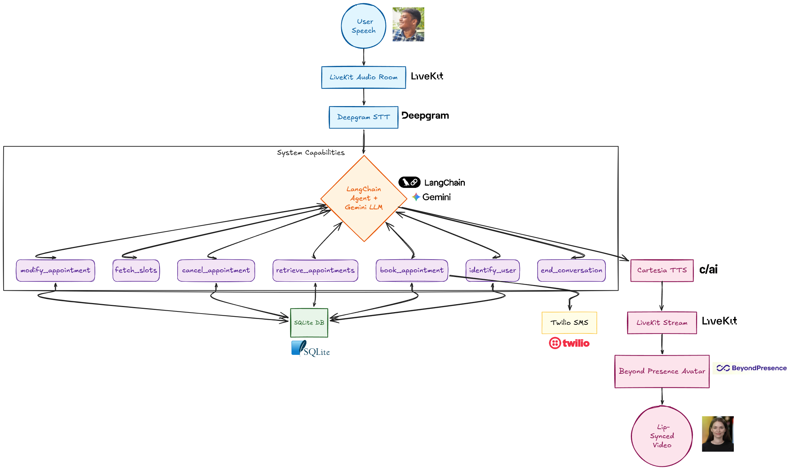

# sami.ai


A production-ready AI voice agent for hospital front desks. Patients speak naturally to book, manage, modify, and cancel appointments. The system uses LiveKit for real-time voice streaming, Deepgram for STT, Cartesia for TTS, Gemini as the LLM, and Beyond Presence for a lip-synced avatar.

---

## Architecture



**Tool execution events** are broadcast via LiveKit data channel to the frontend in real time.

---

## AI Agents & Components

### **Voice Agent** (`backend/app/agents/voice_agent.py`)

The main AI receptionist that handles patient conversations through natural voice interaction.

**Core Components:**
- **Silero VAD**: Voice Activity Detection - detects when user starts/stops speaking
- **Deepgram STT**: Speech-to-Text - transcribes patient speech to text with high accuracy
- **LangChain AgentExecutor**: Orchestrates tool calling and conversation flow
- **Gemini 2.5 Flash**: Large Language Model - understands intent and generates responses
- **Cartesia TTS**: Text-to-Speech - converts AI responses to natural human speech

**Workflow:**
1. **Patient speaks** → Silero VAD detects speech activity
2. **Deepgram transcribes** audio to text in real-time
3. **LangChain processes** text through Gemini with available tools
4. **AI generates response** using conversation context and tools
5. **Cartesia converts** response text to natural speech
6. **Audio streams** back to patient via LiveKit

**Rate Limiting & Reliability:**
- Built-in retry logic for Gemini API rate limits (429 errors)
- Session-wide locking prevents concurrent API calls
- Graceful fallback messages during high load

---

### **Appointment Tools** (`backend/app/tools/appointment_tools.py`)

LangChain tools that handle all hospital appointment operations.

#### **`identify_user`**
- **Purpose**: Register or lookup patients by phone number
- **Database**: Creates/queries User table with phone + name
- **Broadcast**: Real-time UI updates showing patient identification

#### **`fetch_slots`**
- **Purpose**: Retrieve available appointment slots
- **Filtering**: By doctor ID or medical specialization
- **Data**: Returns doctors with their available dates/times
- **Source**: Pre-configured doctor schedules and time slots

#### **`book_appointment`**
- **Purpose**: Book new appointments for identified patients
- **Validation**: Prevents double-booking same time slots
- **Database**: Creates Appointment records with confirmed status
- **Confirmation**: Returns booking details for patient confirmation

#### **`retrieve_appointments`**
- **Purpose**: Get all appointments for current patient
- **Filtering**: Only returns appointments belonging to identified user
- **Display**: Shows appointment history with doctor, date, time, status

#### **`cancel_appointment`**
- **Purpose**: Cancel existing appointments
- **Security**: Only allows cancellation of user's own appointments
- **Validation**: Checks appointment exists and belongs to user
- **Status**: Updates appointment status to "cancelled"

#### **`modify_appointment`**
- **Purpose**: Reschedule existing appointments
- **Conflict Detection**: Ensures new time slot is available
- **Validation**: Prevents double-booking during rescheduling
- **Update**: Modifies date/time while preserving appointment record

#### **`end_conversation`**
- **Purpose**: Gracefully end call and generate summary
- **Summary**: Captures session details and appointment changes
- **Broadcast**: Sends final summary to frontend for display

---

### **Backend API** (`backend/app/main.py`)

FastAPI server that provides REST endpoints and serves the web interface.

**Endpoints:**
- **`/appointments`**: CRUD operations for appointments
- **`/livekit/token`**: Generates LiveKit room tokens for secure connections
- **`/summary`**: Handles conversation summaries and analytics

**Features:**
- CORS middleware for frontend integration
- SQLAlchemy async sessions for database operations
- Automatic API documentation with Swagger/OpenAPI

---

### **Frontend Interface** (`frontend/`)

Next.js React application providing the patient-facing web interface.

**Components:**
- **`VoiceInterface.tsx`**: Main call controls and microphone management
- **`Avatar.tsx`**: AI receptionist avatar with lip-sync (Beyond Presence)
- **`Transcript.tsx`**: Real-time conversation transcript display
- **`AppointmentPanel.tsx`**: Appointment management interface
- **`ToolExecution.tsx`**: Visual feedback for AI tool operations

**LiveKit Integration:**
- Room connection management
- Audio track publishing/subscribing
- Real-time data channel for tool events
- Automatic reconnection handling

---

## Environment Setup

### Backend `.env`

Copy `backend/.env` and fill in your keys:

```env
LIVEKIT_URL=wss://your-project.livekit.cloud
LIVEKIT_API_KEY=your_livekit_api_key
LIVEKIT_API_SECRET=your_livekit_api_secret
DEEPGRAM_API_KEY=your_deepgram_api_key
CARTESIA_API_KEY=your_cartesia_api_key
GEMINI_API_KEY=your_gemini_api_key
BEYOND_PRESENCE_API_KEY=your_beyond_presence_api_key
TWILIO_ACCOUNT_SID=your_twilio_account_sid
TWILIO_AUTH_TOKEN=your_twilio_auth_token
TWILIO_PHONE_NUMBER=+1234567890
```

### Frontend `.env`

Copy `frontend/.env` and fill in:

```env
NEXT_PUBLIC_LIVEKIT_URL=wss://your-project.livekit.cloud
NEXT_PUBLIC_API_URL=http://localhost:8000
NEXT_PUBLIC_BEYOND_PRESENCE_API_KEY=your_beyond_presence_api_key
```

---

## Running Locally

### 1. Backend API Server

```bash
cd backend
python -m venv venv
# Windows:
venv\Scripts\activate
# macOS/Linux:
source venv/bin/activate

pip install -r requirements.txt
uvicorn app.main:app --reload --port 8000
```

The API will be available at `http://localhost:8000`.

### 2. LiveKit Voice Agent (separate terminal)

```bash
cd backend
source venv/bin/activate  # or venv\Scripts\activate

python -m app.agents.voice_agent dev
```

The agent worker connects to LiveKit and waits for rooms to be created.

### 3. Frontend

```bash
cd frontend
npm install
npm run dev
```

Open `http://localhost:3000`.
